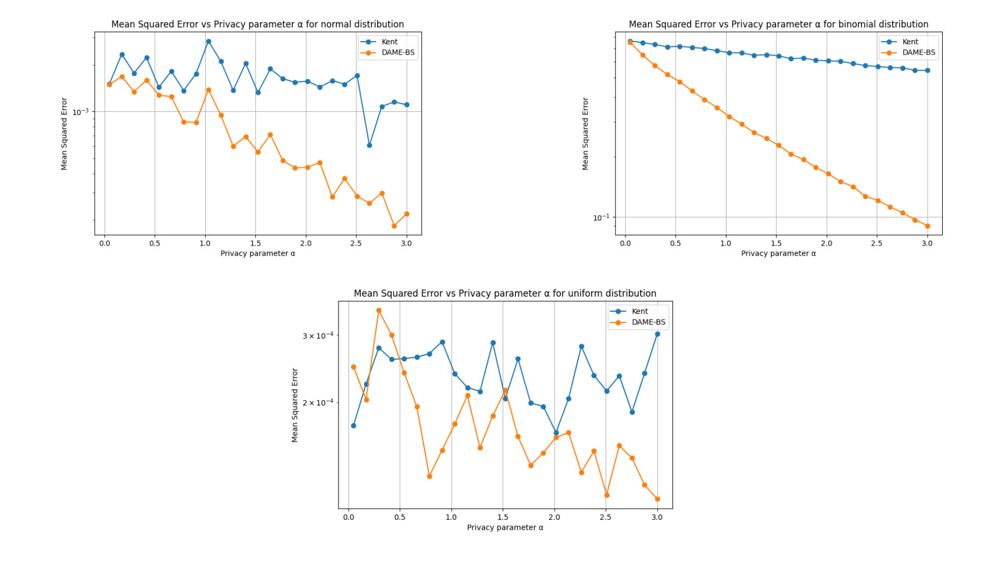
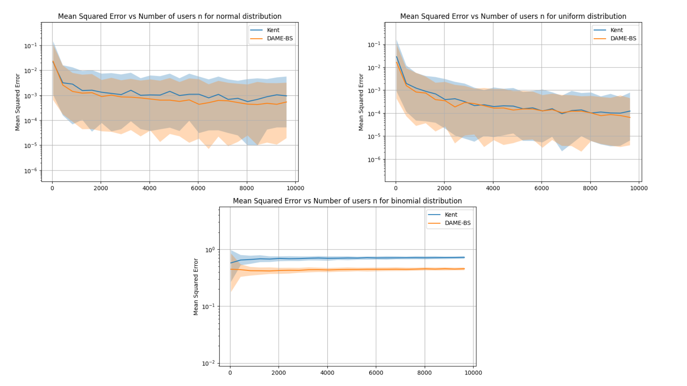
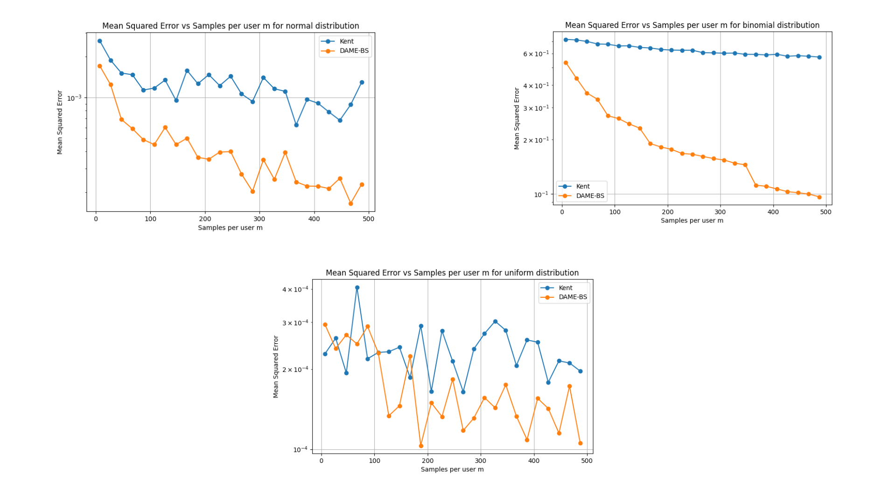
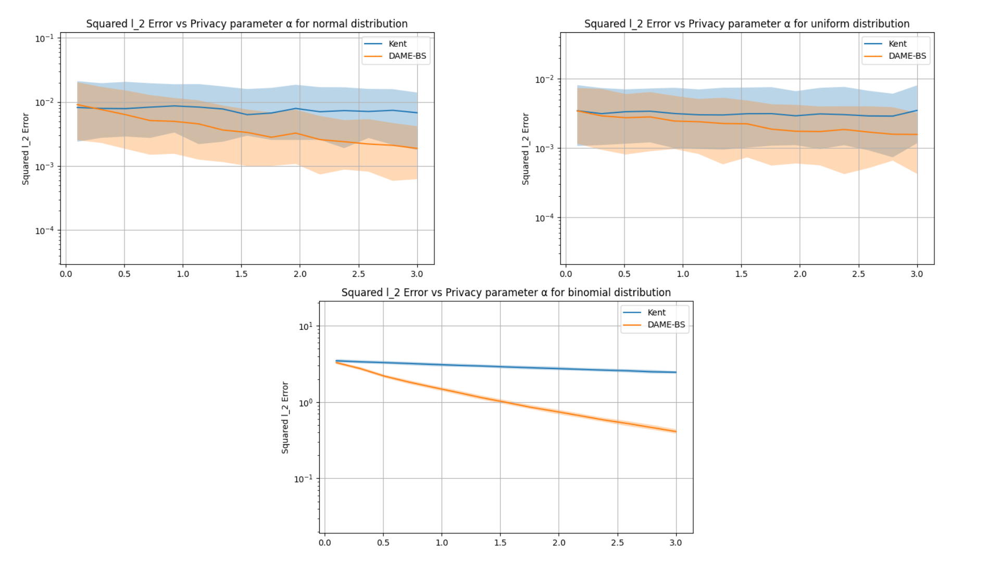
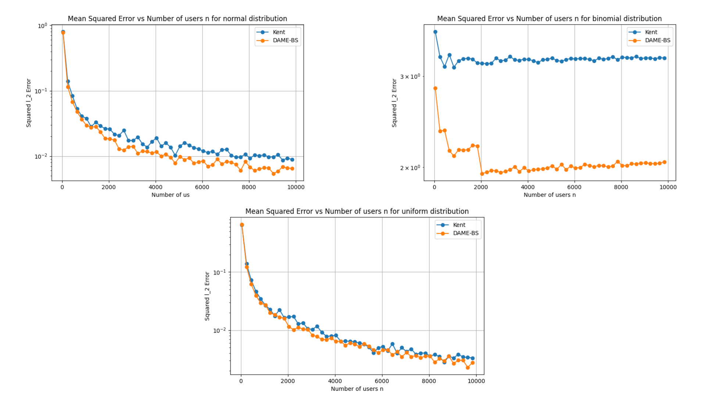
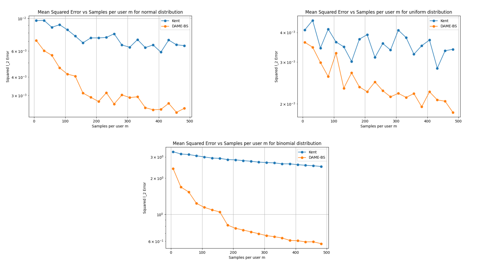

# DAME-BS: Differentially Private Mean Estimation via Binary Search

[](https://dl.circleci.com/status-badge/redirect/gh/kanu2406/DAME-BS/tree/main) [](https://codecov.io/gh/kanu2406/DAME-BS)

This repository provides a Python implementation of the **DAME-BS** algorithm for locally differentially private mean estimation using binary search. It includes theoretical upper bounds and experiments across multiple distributions.

## Documentation

The documentation can be found here -

https://kanu2406.github.io/DAME-BS/


---

## Requirements

```python
numpy>=1.12
matplotlib>=2.0.0
pytest>=6.2.5
tqdm>=4.62.0
sphinx>=5.3.0
sphinx_rtd_theme>=1.3.0
pytest>=8.0.0
pytest-cov>=4.1.0
```

All dependencies are listed in requirements.txt.


```bash
pip install -r requirements.txt
```

## Installation
Clone the repository:

```bash
git clone https://github.com/kanu2406/DAME-BS.git
cd DAME-BS
```

## Experiments
You can run the included experiments to replicate results by directly running the file named `run_experiments.py`:

```python
python experiments/run_experiments.py
```

## Basic Example

```python
import numpy as np
import math
from dame_bs.dame_bs import dame_with_binary_search
from dame_bs.binary_search import attempting_insertion_using_binary_search
from experiments.univariate_experiment import generate_univariate_scaled_data
 
alpha = 0.6
n = 20000
m = 20
true_mean = 0.3
delta = 0.1

# Generate univariate scaled data from a supported distribution with a given mean
distribution = "normal"
user_samples, true_mean_scaled= generate_univariate_scaled_data(distribution,n,m, true_mean)

# Estimated Interval
L, R = attempting_insertion_using_binary_search(alpha, delta, n, m, user_samples)
print(f"Binary Search Interval: [{L:.3f}, {R:.3f}]")

# Estimated Mean
bar_theta = dame_with_binary_search(n, alpha, m, user_samples)
print(f"Final mean Estimate: {bar_theta:.3f}")


```

## Results

### Univariate Case

Following plots compares of dame_bs and Kent's algorithm by displaying how mean squared error changes with different parameters like 𝛼,n or m for univariate case.

#### Mean squared error vs alpha (privacy parameter)

<p align="center"></p>


#### Mean squared error vs n (number of users)

<p align="center"></p>


#### Mean squared error vs m (number of samples per user)

<p align="center"></p>

### Multivariate Case

Following plots compares of dame_bs and Kent's algorithm by displaying how mean squared error changes with different parameters like 𝛼,n or m for multivariate case.

#### Mean squared error vs alpha (privacy parameter)


<p align="center"></p>


#### Mean squared error vs n (number of users)


<p align="center"></p>


Mean squared error vs m (number of samples per user)
----------------------------------------------------

<p align="center"></p>


## License

This project is licensed under the [MIT License](LICENSE).


