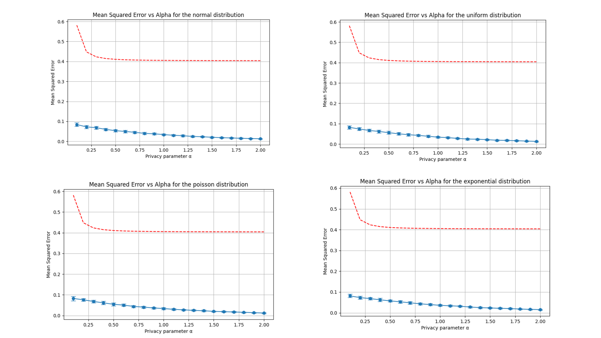
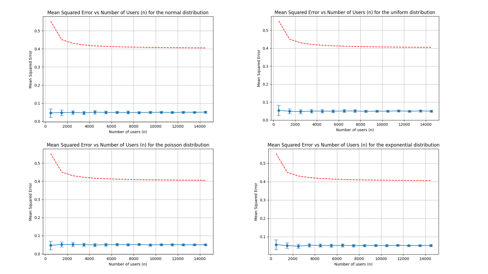

Usage 
=====

This section presents usage examples of the DAME-BS algorithm.

Risk\_vs\_alpha 
---------------

.. automodule:: experiments.risk_vs_alpha
   :members:
   :show-inheritance:
   :undoc-members:

Risk\_vs\_n 
-----------

.. automodule:: experiments.risk_vs_n
   :members:
   :show-inheritance:
   :undoc-members:

Risk\_vs\_delta
---------------

.. automodule:: experiments.risk_vs_delta
   :members:
   :show-inheritance:
   :undoc-members:

Risk\_vs\_n\_with\_alpha
------------------------

.. automodule:: experiments.risk_vs_n_with_alpha
   :members:
   :show-inheritance:
   :undoc-members:

Results
-------
Mean Squared Error vs Alpha for the different distributions.

Mean Squared Error vs n (total number of users) for the different distributions.

Mean Squared Error vs delta (tolerated failure probability of Binary Search) for the different distributions.

.. image:: ../figures/risk_vs_delta.png
   :alt: Mean Squared Error vs delta (tolerated failure probability of Binary Search) for the different distributions
   :align: center
   :width: 600px

Mean Squared Error vs n (total number of users) for the different distributions for different values of privacy parameter alpha.

.. image:: ../figures/risk_vs_n_diff_alpha.png
   :alt: Mean Squared Error vs n (total number of users) for the different distributions
   :align: center
   :width: 600px
