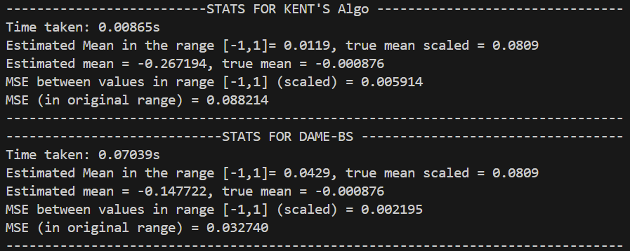

Experiments
===========

This section presents experiments done to compare the DAME-BS algorithm and Kent's algorithm for both univariate and multivariate cases.

Univariate Experiments
----------------------

.. automodule:: experiments.univariate_experiment
   :members:
   :show-inheritance:
   :undoc-members:

Multivariate Experiments 
------------------------

.. automodule:: experiments.multivariate_experiment
   :members:
   :show-inheritance:
   :undoc-members:

Results
=======

This section presents a comparison between the dame_bs algorithm and Kent's algorithm in both
the univariate and multivariate case. We generated datasets from three distributions—
Normal, Uniform, and Binomial—with a mean of 0.1. All data points and the true mean were then 
scaled to the range [-1, 1]. The comparison was based on the mean squared error between the 
estimated mean and the scaled true mean across 50 trials.

Univariate case
---------------

Mean Squared Error vs privacy parameter alpha for the different distributions.

.. image:: ../figures/mse_vs_alpha_univariate.png
   :alt: Mean Squared Error vs Alpha for the different distributions
   :align: center
   :width: 600px

Mean Squared Error vs n (total number of users) for the different distributions.

.. image:: ../figures/mse_vs_n_univariate.png
   :alt: Mean Squared Error vs n (total number of users) for the different distributions
   :align: center
   :width: 600px

Mean Squared Error vs m (number of samples per user) for the different distributions.

.. image:: ../figures/mse_vs_m_univariate.png
   :alt: MSE vs m for the different distributions
   :align: center
   :width: 600px

Multivariate case
-----------------

Mean Squared Error vs privacy parameter alpha for the different distributions.

.. image:: ../figures/mse_vs_alpha_multivariate.png
   :alt: Mean Squared Error vs Alpha for the different distributions
   :align: center
   :width: 600px

Mean Squared Error vs n (total number of users) for the different distributions.

.. image:: ../figures/mse_vs_n_multivariate.png
   :alt: Mean Squared Error vs n (total number of users) for the different distributions
   :align: center
   :width: 600px

Mean Squared Error vs m (number of samples per user) for the different distributions.

.. image:: ../figures/mse_vs_m_multivariate.png
   :alt: MSE vs m for the different distributions
   :align: center
   :width: 600px

Real World Data 
---------------

We experimented mean estimation algorithm for estimating mean price of stocks data. We treated each stock as a user and used stocks price history 
as samples. We used 249 per stock and compared Kent's algorithm and DAME-BS. Following are the time taken and mean squared errors between 
scaled values in range [-1,1] and on the true scale of prices.

